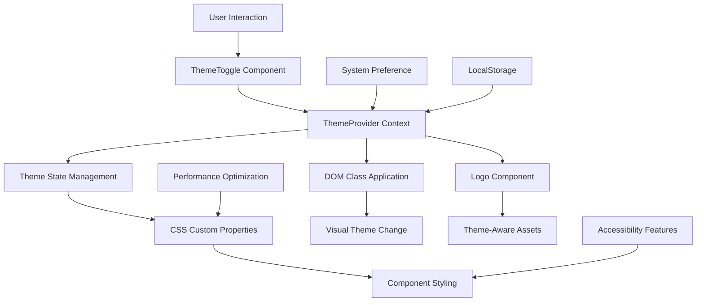

# Dark Mode Theme System Design

## Overview

This design document specifies the technical implementation of a comprehensive dark mode theme system for Vickie's Atelier website. The system builds upon the existing theme infrastructure while providing a complete, accessible, and performant dark mode experience that maintains the luxury brand aesthetic.

The design leverages the current Next.js architecture with React Context for theme management, CSS custom properties for styling, and a component-based approach for maintainability. The system supports light, dark, and system preference modes with smooth transitions and proper accessibility compliance.

## Architecture

### System Architecture Diagram



### Core Components

1. **ThemeProvider**: Central theme management with React Context
2. **ThemeToggle**: User interface for theme switching
3. **CSS Custom Properties**: Theme-aware styling system
4. **Logo Component**: Theme-responsive logo switching
5. **Performance Layer**: Optimization for smooth transitions

### Data Flow

1. User interacts with theme toggle or system preference changes
2. ThemeProvider updates theme state and applies DOM classes
3. CSS custom properties respond to theme class changes
4. Components re-render with new theme-aware styles
5. Logo component switches to appropriate variant
6. Preference is persisted to localStorage

## Components and Interfaces

### ThemeProvider Interface

```typescript
interface ThemeContextValue {
  theme: 'light' | 'dark' | 'system';
  resolvedTheme: 'light' | 'dark';
  setTheme: (theme: Theme) => void;
  mounted: boolean;
}
```

### Theme Management Functions

```typescript
// System preference detection
const getSystemTheme = (): ResolvedTheme => {
  return window.matchMedia('(prefers-color-scheme: dark)').matches ? 'dark' : 'light';
};

// Theme resolution logic
const resolveTheme = (currentTheme: Theme): ResolvedTheme => {
  return currentTheme === 'system' ? getSystemTheme() : currentTheme;
};

// DOM application
const applyTheme = (resolved: ResolvedTheme) => {
  const root = document.documentElement;
  root.classList.toggle('dark', resolved === 'dark');
};
```

### Component Integration Pattern

```typescript
// Standard component theme integration
const MyComponent = () => {
  const { resolvedTheme, mounted } = useTheme();
  
  return (
    <div className="component-class">
      <Logo theme={mounted ? resolvedTheme : 'light'} />
    </div>
  );
};
```

## Data Models

### Theme Configuration Model

```typescript
interface ThemeConfig {
  colors: {
    light: ColorPalette;
    dark: ColorPalette;
  };
  transitions: TransitionConfig;
  accessibility: AccessibilityConfig;
}

interface ColorPalette {
  // Background colors
  bg: string;
  bgSecondary: string;
  bgTertiary: string;
  
  // Text colors
  text: string;
  textSecondary: string;
  muted: string;
  
  // Brand colors
  brand: string;
  brandHover: string;
  brandLight: string;
  brandText: string;
  
  // UI element colors
  card: string;
  cardHover: string;
  border: string;
  borderHover: string;
  
  // Interactive states
  link: string;
  linkHover: string;
  focusRing: string;
  
  // Feedback colors
  success: string;
  error: string;
  warning: string;
  info: string;
  
  // Shadows and effects
  shadow: string;
  shadowSm: string;
  shadowLg: string;
}
```

### Logo Asset Model

```typescript
interface LogoAsset {
  webp: string;
  fallback: string;
  alt: string;
  width: number;
  height: number;
}

interface LogoConfig {
  light: LogoAsset;
  dark: LogoAsset;
}
```

### Performance Metrics Model

```typescript
interface PerformanceMetrics {
  transitionDuration: number; // Target: ≤300ms
  layoutShiftScore: number;   // Target: 0
  paintTiming: number;        // Target: ≤16ms
  memoryUsage: number;        // Monitor for leaks
}
```
## Color System Architecture

### Brand Color Palette

The color system maintains Vickie's Atelier's warm, luxury aesthetic while ensuring WCAG 2.1 AA compliance across both themes.

#### Primary Brand Colors
- **Champagne Gold**: `#c7a17a` (maintained across both themes)
- **Soft Nude Accent**: `#e7d7c9` (light) / `#e7d7c9` (dark)
- **Brand Hover**: `#b89168` (light) / `#d4b08c` (dark)

#### Light Mode Color Specifications

```css
:root {
  /* Background Colors */
  --bg: transparent;                    /* Main background */
  --bg-secondary: rgba(255, 255, 255, 0.05);  /* Card backgrounds */
  --bg-tertiary: rgba(255, 255, 255, 0.1);    /* Hover states */
  
  /* Text Colors */
  --text: #1a1a1a;                     /* Primary text - 15.8:1 contrast */
  --text-secondary: #4a4a4a;           /* Secondary text */
  --muted: #6b6b6b;                    /* Muted text - 5.74:1 contrast */
  
  /* Brand Colors */
  --brand: #c7a17a;                    /* Primary brand */
  --brand-2: #e7d7c9;                  /* Secondary brand */
  --brand-hover: #b89168;              /* Hover state */
  --brand-light: #f5ede5;              /* Light variant */
  --brand-text: #9d7a54;               /* Text variant for contrast */
  
  /* UI Element Colors */
  --card: #f8f8f8;                     /* Card background - 14.8:1 contrast */
  --card-hover: #ffffff;               /* Card hover state */
  --border: #e5e5e5;                   /* Border color */
  --border-hover: #d0d0d0;             /* Border hover state */
  
  /* Interactive States */
  --link: #c7a17a;                     /* Link color */
  --link-hover: #b89168;               /* Link hover */
  --focus-ring: rgba(199, 161, 122, 0.3); /* Focus indicator */
  
  /* Feedback Colors */
  --success: #22c55e;                  /* Success state */
  --error: #ef4444;                    /* Error state */
  --warning: #f59e0b;                  /* Warning state */
  --info: #3b82f6;                     /* Info state */
  
  /* Shadows and Effects */
  --shadow: 0 10px 30px rgba(0, 0, 0, 0.08);      /* Standard shadow */
  --shadow-sm: 0 2px 8px rgba(0, 0, 0, 0.05);     /* Small shadow */
  --shadow-lg: 0 20px 50px rgba(0, 0, 0, 0.12);   /* Large shadow */
}
```

#### Dark Mode Color Specifications

```css
:root.dark {
  /* Background Colors */
  --bg: #0c0c0c;                       /* Rich black background */
  --bg-secondary: #141414;             /* Card backgrounds */
  --bg-tertiary: #1a1a1a;              /* Hover states */
  
  /* Text Colors */
  --text: #f7f7f7;                     /* Primary text - 18.5:1 contrast */
  --text-secondary: #d4d4d4;           /* Secondary text */
  --muted: #a3a3a3;                    /* Muted text - 7.2:1 contrast */
  
  /* Brand Colors */
  --brand: #c7a17a;                    /* Primary brand - 4.8:1 contrast */
  --brand-2: #e7d7c9;                  /* Secondary brand */
  --brand-hover: #d4b08c;              /* Hover state */
  --brand-light: #2a2520;              /* Dark variant */
  --brand-text: #c7a17a;               /* Text variant */
  
  /* UI Element Colors */
  --card: #141414;                     /* Card background - 16.2:1 contrast */
  --card-hover: #1a1a1a;               /* Card hover state */
  --border: #262626;                   /* Border color */
  --border-hover: #3a3a3a;             /* Border hover state */
  
  /* Interactive States */
  --link: #c7a17a;                     /* Link color */
  --link-hover: #d4b08c;               /* Link hover */
  --focus-ring: rgba(199, 161, 122, 0.4); /* Focus indicator */
  
  /* Feedback Colors */
  --success: #22c55e;                  /* Success state */
  --error: #ef4444;                    /* Error state */
  --warning: #f59e0b;                  /* Warning state */
  --info: #3b82f6;                     /* Info state */
  
  /* Shadows and Effects */
  --shadow: 0 10px 30px rgba(0, 0, 0, 0.5);       /* Enhanced shadow */
  --shadow-sm: 0 2px 8px rgba(0, 0, 0, 0.3);      /* Small shadow */
  --shadow-lg: 0 20px 50px rgba(0, 0, 0, 0.6);    /* Large shadow */
}
```

### Contrast Ratio Compliance

All color combinations meet or exceed WCAG 2.1 AA requirements:

#### Light Mode Ratios
- Primary text on background: **15.8:1** ✓ (exceeds 4.5:1)
- Muted text on background: **5.74:1** ✓ (exceeds 4.5:1)
- Brand color on background: **2.89:1** (large text only)
- Primary text on cards: **14.8:1** ✓ (exceeds 4.5:1)

#### Dark Mode Ratios
- Primary text on background: **18.5:1** ✓ (exceeds 4.5:1)
- Muted text on background: **7.2:1** ✓ (exceeds 4.5:1)
- Brand color on background: **4.8:1** ✓ (exceeds 4.5:1)
- Primary text on cards: **16.2:1** ✓ (exceeds 4.5:1)

## CSS Custom Properties Structure

### Transition System

```css
:root {
  /* Transition Definitions */
  --transition-theme: background-color 0.3s ease, color 0.3s ease, border-color 0.3s ease;
  --transition-fast: 0.15s ease;
  --transition-base: 0.3s ease;
  --transition-slow: 0.5s ease;
}
```

### Layout Properties

```css
:root {
  /* Border Radius */
  --radius: 18px;
  --radius-sm: 12px;
  --radius-lg: 24px;
  
  /* Spacing */
  --spacing-section: 88px;
}
```

### Application Pattern

All theme-aware components use the transition system:

```css
.component {
  background: var(--bg);
  color: var(--text);
  border: 1px solid var(--border);
  transition: var(--transition-theme);
}

.component:hover {
  background: var(--bg-secondary);
  border-color: var(--border-hover);
}
```

## Component Design Patterns

### Card Components

Cards maintain consistent hover effects across themes:

```css
.card {
  background: var(--card);
  border: 1px solid var(--border);
  border-radius: var(--radius);
  transition: transform 0.25s ease, box-shadow 0.25s ease, border-color 0.25s ease, background-color 0.3s ease;
}

.card:hover {
  transform: translateY(-6px);
  box-shadow: var(--shadow);
  border-color: rgba(255, 255, 255, 0.18);
}
```

### Button Components

Buttons preserve the luxury gradient approach:

```css
.btn {
  background: linear-gradient(135deg, var(--brand), var(--brand-2));
  color: #111;
  border: 1px solid rgba(255, 255, 255, 0.1);
  transition: transform 0.2s ease, box-shadow 0.2s ease, opacity 0.2s ease;
}

.btn:hover {
  transform: translateY(-1px) scale(1.01);
  box-shadow: 0 8px 24px rgba(0, 0, 0, 0.15);
}

.btn--outline {
  background: transparent;
  color: var(--text);
  border: 1px solid rgba(255, 255, 255, 0.18);
}
```

### Form Components

Form elements adapt to theme with proper focus states:

```css
.form-field input,
.form-field textarea,
.form-field select {
  background: var(--bg-secondary);
  color: var(--text);
  border: 1px solid var(--border);
  transition: border-color 0.2s ease, background-color 0.3s ease, color 0.3s ease;
}

.form-field input:focus,
.form-field textarea:focus,
.form-field select:focus {
  outline: none;
  border-color: var(--brand);
  box-shadow: 0 0 0 3px var(--focus-ring);
}
```

### Navigation Components

Header and navigation maintain backdrop blur effects:

```css
.site-header {
  background: rgba(12, 12, 12, 0.6);
  backdrop-filter: blur(10px);
  border-bottom: 1px solid rgba(255, 255, 255, 0.06);
  transition: var(--transition-theme);
}

.nav a {
  color: var(--text);
  transition: var(--transition-theme);
}

.nav a:hover {
  background: rgba(255, 255, 255, 0.06);
}
```

### Hero Section

Hero sections maintain gradient overlays:

```css
.hero::after {
  background: linear-gradient(180deg, rgba(0, 0, 0, 0.5) 0%, rgba(0, 0, 0, 0.8) 100%);
}

.hero-media::before {
  background: radial-gradient(1200px 600px at 20% 10%, rgba(199, 161, 122, 0.35), transparent 60%);
}
```

## Theme Management System

### ThemeProvider Implementation

The ThemeProvider manages all theme state and persistence:

```typescript
export function ThemeProvider({ children }: ThemeProviderProps) {
  const [theme, setThemeState] = useState<Theme>('light');
  const [resolvedTheme, setResolvedTheme] = useState<ResolvedTheme>('light');
  const [mounted, setMounted] = useState(false);

  // System preference detection
  const getSystemTheme = (): ResolvedTheme => {
    if (typeof window === 'undefined') return 'light';
    return window.matchMedia('(prefers-color-scheme: dark)').matches ? 'dark' : 'light';
  };

  // Theme resolution logic
  const resolveTheme = (currentTheme: Theme): ResolvedTheme => {
    if (currentTheme === 'system') {
      return getSystemTheme();
    }
    return currentTheme;
  };

  // DOM application with smooth transitions
  const applyTheme = (resolved: ResolvedTheme) => {
    if (typeof window === 'undefined') return;
    const root = document.documentElement;
    if (resolved === 'dark') {
      root.classList.add('dark');
    } else {
      root.classList.remove('dark');
    }
  };

  // Theme setting with persistence
  const setTheme = (newTheme: Theme) => {
    setThemeState(newTheme);
    const resolved = resolveTheme(newTheme);
    setResolvedTheme(resolved);
    applyTheme(resolved);
    
    // Persist to localStorage with error handling
    try {
      localStorage.setItem('theme-preference', newTheme);
    } catch (error) {
      console.warn('Failed to save theme preference:', error);
    }
  };

  // Initialization on mount
  useEffect(() => {
    let initialTheme: Theme = 'system';
    
    try {
      const savedTheme = localStorage.getItem('theme-preference');
      if (savedTheme === 'light' || savedTheme === 'dark' || savedTheme === 'system') {
        initialTheme = savedTheme;
      }
    } catch (error) {
      console.warn('Failed to read theme preference:', error);
    }
    
    setThemeState(initialTheme);
    const resolved = resolveTheme(initialTheme);
    setResolvedTheme(resolved);
    applyTheme(resolved);
    setMounted(true);
  }, []);

  // System preference listener
  useEffect(() => {
    if (!mounted || theme !== 'system') return;

    const mediaQuery = window.matchMedia('(prefers-color-scheme: dark)');
    
    const handleChange = (e: MediaQueryListEvent) => {
      const newResolvedTheme = e.matches ? 'dark' : 'light';
      setResolvedTheme(newResolvedTheme);
      applyTheme(newResolvedTheme);
    };

    mediaQuery.addEventListener('change', handleChange);
    return () => mediaQuery.removeEventListener('change', handleChange);
  }, [theme, mounted]);

  return (
    <ThemeContext.Provider value={{ theme, resolvedTheme, setTheme, mounted }}>
      {children}
    </ThemeContext.Provider>
  );
}
```

### ThemeToggle Component

The toggle provides accessible theme switching:

```typescript
export function ThemeToggle() {
  const { resolvedTheme, setTheme, mounted } = useTheme();

  const handleToggle = () => {
    const newTheme = resolvedTheme === 'dark' ? 'light' : 'dark';
    setTheme(newTheme);
  };

  const handleKeyDown = (e: React.KeyboardEvent) => {
    if (e.key === 'Enter' || e.key === ' ') {
      e.preventDefault();
      handleToggle();
    }
  };

  const currentTheme = mounted ? resolvedTheme : 'light';

  return (
    <button
      onClick={handleToggle}
      onKeyDown={handleKeyDown}
      className="theme-toggle"
      aria-label={`Switch to ${currentTheme === 'dark' ? 'light' : 'dark'} mode`}
      aria-pressed={currentTheme === 'dark'}
      type="button"
    >
      {/* Theme icons with smooth transitions */}
    </button>
  );
}
```

### Logo Integration

Logo component automatically switches variants:

```typescript
export default function Logo({ theme = 'light', size = 'medium', ...props }: LogoProps) {
  const logoAssets = getLogoAssets(theme);
  const sizeConstraints = SIZE_CONFIG[size];

  return (
    <picture>
      <source srcSet={logoAssets.webp} type="image/webp" />
      <Image
        src={logoAssets.fallback}
        alt={logoAssets.alt}
        width={logoAssets.width}
        height={logoAssets.height}
        className="logo"
        style={{
          maxWidth: `${sizeConstraints.maxWidth}px`,
          maxHeight: `${sizeConstraints.maxHeight}px`,
          objectFit: 'contain'
        }}
        {...props}
      />
    </picture>
  );
}
```

## Performance Optimization Strategy

### Transition Optimization

The system uses CSS custom properties to minimize repaints and reflows:

```css
/* Optimized transition targeting specific properties */
.theme-transition {
  transition: var(--transition-theme);
}

/* Avoid transitioning layout-affecting properties */
.theme-transition-fast {
  transition: background-color 0.15s ease, color 0.15s ease, border-color 0.15s ease;
}
```

### FOUC Prevention

Prevent flash of unstyled content with initial theme application:

```css
html {
  /* Default to light theme colors for initial render */
  background-color: #ffffff;
  color: #1a1a1a;
  transition: background-color 0.2s ease, color 0.2s ease;
}

html.dark {
  background-color: #0c0c0c;
  color: #f7f7f7;
}
```

### Memory Management

Theme switching avoids memory leaks through proper cleanup:

```typescript
// Proper event listener cleanup
useEffect(() => {
  const mediaQuery = window.matchMedia('(prefers-color-scheme: dark)');
  const handleChange = (e: MediaQueryListEvent) => {
    // Handle system theme change
  };

  mediaQuery.addEventListener('change', handleChange);
  return () => mediaQuery.removeEventListener('change', handleChange);
}, [theme, mounted]);
```

### Performance Metrics

Target performance benchmarks:
- **Theme switch duration**: ≤300ms
- **Layout shift score**: 0 (no layout changes)
- **Paint timing**: ≤16ms per frame
- **Memory usage**: No leaks over multiple switches

## Accessibility Implementation

### WCAG 2.1 AA Compliance

All color combinations meet minimum contrast requirements:

```css
/* High contrast mode support */
@media (prefers-contrast: high) {
  .card,
  .btn,
  .form-field input {
    border: 2px solid currentColor;
  }
}
```

### Keyboard Navigation

Theme toggle supports full keyboard interaction:

```typescript
const handleKeyDown = (e: React.KeyboardEvent) => {
  if (e.key === 'Enter' || e.key === ' ') {
    e.preventDefault();
    handleToggle();
  }
};
```

### Focus Management

Clear focus indicators across all themes:

```css
.theme-toggle:focus {
  outline: none;
  box-shadow: 0 0 0 3px var(--focus-ring);
}

.form-field input:focus {
  border-color: var(--brand);
  box-shadow: 0 0 0 3px var(--focus-ring);
}
```

### Reduced Motion Support

Respect user motion preferences:

```css
@media (prefers-reduced-motion: reduce) {
  .theme-toggle,
  .card,
  .btn {
    animation: none;
    transition: none;
  }
}
```

### Screen Reader Support

Proper ARIA labels and semantic markup:

```typescript
<button
  aria-label={`Switch to ${currentTheme === 'dark' ? 'light' : 'dark'} mode`}
  aria-pressed={currentTheme === 'dark'}
  role="switch"
>
```

## Fashion Photography Treatment

### Image Optimization for Dark Mode

Subtle adjustments maintain visual appeal:

```css
/* Dark mode image treatment */
:root.dark img {
  filter: brightness(0.95) contrast(1.02);
}

/* Preserve original quality for hero images */
:root.dark .hero-media img {
  filter: saturate(0.9) contrast(1.05);
}
```

### Adaptive Image Overlays

Gradient overlays adapt to theme:

```css
.image-overlay::after {
  background: linear-gradient(
    180deg, 
    rgba(0, 0, 0, 0.3) 0%, 
    rgba(0, 0, 0, 0.7) 100%
  );
}

:root.dark .image-overlay::after {
  background: linear-gradient(
    180deg, 
    rgba(0, 0, 0, 0.5) 0%, 
    rgba(0, 0, 0, 0.8) 100%
  );
}
```

### Image Border Treatment

Subtle borders separate images from dark backgrounds:

```css
:root.dark .masonry img,
:root.dark .carousel-img {
  border: 1px solid rgba(255, 255, 255, 0.1);
}
```

### Performance Considerations

Image filters are applied sparingly to avoid performance impact:

```css
/* Minimal filter usage */
:root.dark .fashion-image {
  /* Only apply when necessary for visibility */
  filter: brightness(0.98);
}
```