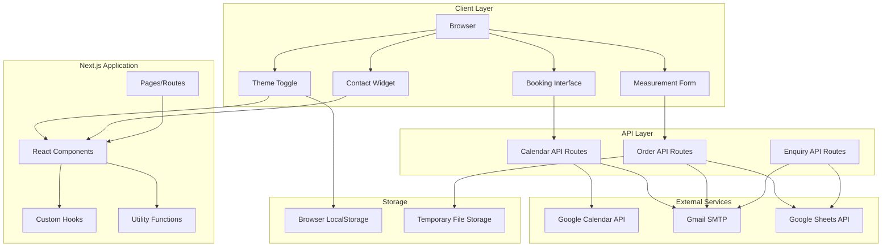

# Design Document: UX Enhancement and Consultation Booking

## Overview

This design document outlines the technical architecture and implementation strategy for enhancing Vickie's Atelier website with improved UX/UI consistency, a consultation booking system integrated with Google Calendar, and features enabling fully remote ordering. The enhancements maintain the existing luxury aesthetic while adding modern functionality including dark/light mode support, Tailwind CSS integration, photo uploads for measurements, and a floating contact widget.

### Goals

- Enable customers to book consultations with the CEO through Google Calendar integration
- Provide quick access to contact methods via a floating widget
- Enhance measurement submission with photo uploads and visual tutorials
- Implement dark/light mode theming with automatic detection and manual override
- Integrate Tailwind CSS while preserving existing custom styles
- Improve logo visibility and button consistency across the site
- Optimize mobile experience with responsive layouts
- Maintain the elegant, luxury aesthetic throughout all enhancements

### Non-Goals

- Redesigning the existing order flow or collections pages
- Implementing payment processing
- Building a customer account system
- Creating a full CMS for content management
- Implementing real-time chat functionality

## Architecture

### High-Level System Architecture



### Technology Stack

- **Frontend Framework**: Next.js 16.1.6 with React 19.2.3
- **Language**: TypeScript 5.x
- **Styling**: Tailwind CSS 3.x + Custom CSS (hybrid approach)
- **Email**: Nodemailer 8.x with Gmail SMTP
- **Calendar**: Google Calendar API via googleapis 171.x
- **Data Storage**: Google Sheets API for order/enquiry persistence
- **File Handling**: Sharp for image optimization
- **State Management**: React hooks (useState, useEffect, useContext)


### Design Principles

1. **Progressive Enhancement**: Core functionality works without JavaScript where possible
2. **Mobile-First**: Design for mobile viewports first, then enhance for desktop
3. **Performance**: Lazy load images, code split routes, optimize assets
4. **Accessibility**: WCAG 2.1 AA compliance for color contrast, keyboard navigation, screen readers
5. **Consistency**: Maintain existing design tokens and luxury aesthetic
6. **Resilience**: Graceful degradation when external services are unavailable

## Components and Interfaces

### Component Hierarchy

```
src/
├── app/
│   ├── layout.tsx (enhanced with theme provider)
│   ├── page.tsx (homepage)
│   ├── consultation/
│   │   └── page.tsx (new booking page)
│   ├── order/
│   │   ├── page.tsx
│   │   └── OrderPageClient.tsx (enhanced with photo upload)
│   ├── services/
│   │   └── page.tsx
│   └── api/
│       ├── calendar/
│       │   ├── available-slots/
│       │   │   └── route.ts (new)
│       │   └── book/
│       │       └── route.ts (new)
│       ├── order/
│       │   └── route.ts (enhanced)
│       └── enquiry/
│           └── route.ts
├── components/
│   ├── ThemeToggle.tsx (new)
│   ├── ThemeProvider.tsx (new)
│   ├── ContactWidget.tsx (new)
│   ├── PhotoUpload.tsx (new)
│   ├── MeasurementDiagrams.tsx (new)
│   ├── BookingCalendar.tsx (new)
│   ├── Header.tsx (enhanced with theme toggle)
│   ├── Footer.tsx (enhanced with theme-aware logo)
│   ├── OrderForm.tsx (enhanced with photo upload)
│   ├── Carousel.tsx
│   ├── CollectionSection.tsx
│   ├── ContactForm.tsx
│   └── Hero.tsx
├── lib/
│   ├── email.ts (enhanced with consultation templates)
│   ├── sheets.ts
│   ├── google-calendar.ts (new)
│   ├── theme.ts (new)
│   └── file-upload.ts (new)
├── hooks/
│   ├── useTheme.ts (new)
│   └── useMediaQuery.ts (new)
└── types/
    └── index.ts (enhanced with new types)
```


### Core Components

#### ThemeProvider Component

**Purpose**: Manages theme state and provides theme context to all components

**Props**:
```typescript
interface ThemeProviderProps {
  children: React.ReactNode;
}
```

**State**:
- `theme`: 'light' | 'dark' | 'system'
- `resolvedTheme`: 'light' | 'dark' (actual applied theme)

**Behavior**:
- Detects system preference on mount
- Reads saved preference from localStorage
- Applies theme class to document root
- Provides theme context to children
- Prevents flash of incorrect theme (FOIT)

#### ThemeToggle Component

**Purpose**: UI control for switching between light and dark modes

**Props**: None (uses theme context)

**Features**:
- Icon-based toggle (sun/moon icons)
- Smooth transition animation
- Keyboard accessible
- ARIA labels for screen readers
- Persists selection to localStorage

#### ContactWidget Component

**Purpose**: Floating widget providing quick access to contact methods

**Props**:
```typescript
interface ContactWidgetProps {
  position?: 'bottom-right' | 'bottom-left';
  offset?: { x: number; y: number };
}
```

**State**:
- `isExpanded`: boolean (collapsed/expanded state)

**Features**:
- Fixed positioning with configurable offset
- Collapsible/expandable with animation
- Email, WhatsApp, and phone links
- Theme-aware styling
- Click-outside to collapse
- Keyboard navigation support
- Mobile-optimized touch targets (44px minimum)


#### PhotoUpload Component

**Purpose**: Handles photo uploads for measurement form

**Props**:
```typescript
interface PhotoUploadProps {
  maxFiles?: number; // default: 5
  maxSizeMB?: number; // default: 10
  onFilesChange: (files: File[]) => void;
  acceptedFormats?: string[]; // default: ['image/jpeg', 'image/png', 'image/heic', 'image/webp']
}
```

**State**:
- `files`: File[]
- `previews`: string[] (data URLs)
- `errors`: string[]

**Features**:
- Drag-and-drop support
- File type validation
- File size validatio
- `error`: string | null
- `selectedDate`: Date

**Features**:
- Fetches available slots from API
- Groups slots by date
- Displays next 14 days
- Highlights selected slot
- Loading and error states
- Refresh capability
- Mobile-optimized scrollable list
- Excludes past dates
rface BookingCalendarProps {
  collectionType: 'bespoke' | 'bridal' | 'rtw';
  onSlotSelect: (slot: TimeSlot) => void;
  selectedSlot?: TimeSlot;
}
```

**State**:
- `availableSlots`: TimeSlot[]
- `loading`: booleansultation time slots

**Props**:
```typescript
inteext

#### BookingCalendar Component

**Purpose**: Interactive calendar for selecting conatures**:
- SVG-based diagrams for each measurement type
- Responsive sizing
- Theme-aware colors
- Tooltip descriptions
- Link to video tutorial
- Accessible alt t: Displays visual guides for taking body measurements

**Props**:
```typescript
interface MeasurementDiagramsProps {
  measurements: Array<'bust' | 'waist' | 'hips' | 'height' | 'shoulder' | 'sleeve' | 'inseam'>;
  tutorialUrl?: string;
}
```

**Feression before submission
- Clear error messages

#### MeasurementDiagrams Component

**Purpose**n
- Image preview with thumbnails
- Remove individual files
- Progress indication during upload
- Comp


#### PhotoUpload Component

**Purpose**: Handles photo uploads for measurement form

**Props**:
```typescript
interface PhotoUploadProps {
  maxFiles?: number; // default: 5
  maxSizeMB?: number; // default: 10
  onFilesChange: (files: File[]) => void;
  acceptedFormats?: string[]; // default: ['image/jpeg', 'image/png', 'image/heic', 'image/webp']
}
```

**State**:
- `files`: File[]
- `previews`: string[] (data URLs)
- `errors`: string[]

**Features**:
- Drag-and-drop support
- File type validation
- File size validation
- Image preview with thumbnails
- Remove individual files
- Progress indication during upload
- Compression before submission
- Clear error messages

#### MeasurementDiagrams Component

**Purpose**: Displays visual guides for taking body measurements

**Props**:
```typescript
interface MeasurementDiagramsProps {
  measurements: Array<'bust' | 'waist' | 'hips' | 'height' | 'shoulder' | 'sleeve' | 'inseam'>;
  tutorialUrl?: string;
}
```

**Features**:
- SVG-based diagrams for each measurement type
- Responsive sizing
- Theme-aware colors
- Tooltip descriptions
- Link to video tutorial
- Accessible alt text
